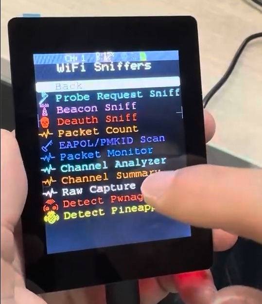
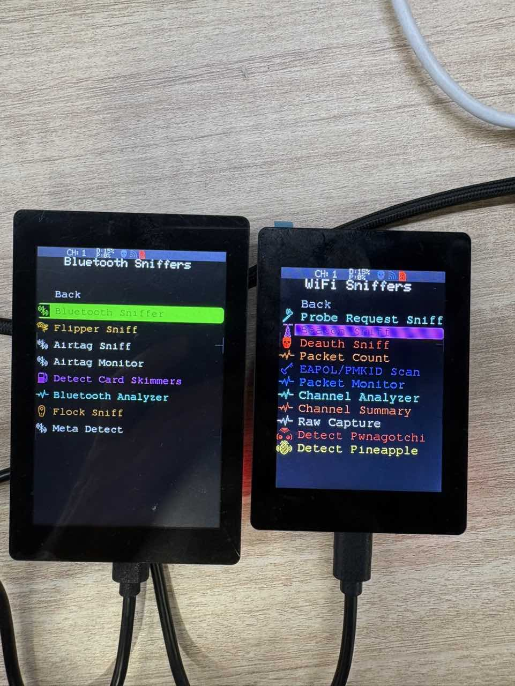

# OpenNextion ESP32 Marauder

[](./README.md)
[](./README.zh-CN.md)

<p align="center">
  
</p>

OpenNextion ESP32 Marauder 是基于
[ESP32 Marauder](https://github.com/justcallmekoko/ESP32Marauder) 的
OpenNextion 板级支持版本。它为 OpenNextion ESP32-S3 矩形显示屏开发板提供
可直接构建的固件目标，支持 SPI TFT LCD、CST826 电容触摸、OPI PSRAM 和
SDMMC 存储。

这个仓库用于在上游板级支持 PR 审核期间，让 ESP32 Marauder 更容易在受支持的
OpenNextion 开发板上完成编译、烧写和验证。

## Supported Displays

当前公开版本面向两款 OpenNextion 竖屏显示开发板：

| Display model | Size | Resolution | Orientation | Status |
| --- | --- | --- | --- | --- |
| [ONX3248G035][onx3248g035] | 3.5 inch | 320 x 480 | Portrait | Verified |
| [ONX2432G028][onx2432g028] | 2.8 inch | 240 x 320 | Portrait | Verified |

构建时需要显式选择开发板目标：

```sh
arduino-cli compile --build-property "compiler.cpp.extra_flags=-DMARAUDER_ONX3248G035" esp32_marauder
arduino-cli compile --build-property "compiler.cpp.extra_flags=-DMARAUDER_ONX2432G028" esp32_marauder
```

不要把为某一款显示屏构建的固件烧写到另一款显示屏上。

## 触摸屏导航

OpenNextion 开发板没有用于 ESP32 Marauder UI 的独立实体按键。界面导航和扫描
控制复用了 ESP32 Marauder 原有的触摸屏菜单和虚拟按键机制，并针对 OpenNextion
屏幕尺寸调整了菜单项、图标、文字和触摸区域的布局。

在菜单界面中，屏幕被划分为三个触摸区域：

- 上方区域：向上移动菜单选择
- 中间区域：确认 / 进入当前菜单
- 下方区域：向下移动菜单选择

在扫描或监控界面中，固件会复用 ESP32 Marauder 原有的屏幕虚拟按键，例如
`X`、`-`、`+`、`HOP` 等。

## Background

ESP32 Marauder 是一个优秀的 ESP32 WiFi 和 Bluetooth 安全工具项目。上游项目
已经支持多种 ESP32 设备，但 OpenNextion ESP32-S3 显示屏开发板需要专门的
板级配置，用于 LCD 初始化、触摸输入、PSRAM、SDMMC 存储和自动化构建。

这个 fork 保留原 ESP32 Marauder 应用行为，并增加支持 OpenNextion 开发板所需
的硬件适配。

## 3D Printed Enclosure

我也为受支持的 OpenNextion 显示屏尺寸设计了简单的 3D 打印外壳，并发布在
MakerWorld。需要的人可以免费下载并打印。

每个外壳都是单件打印，安装也比较简单。撕下对应 OpenNextion 显示屏边缘的
胶带保护层，然后把显示屏压入打印外壳中，利用边缘背胶固定即可。

MakerWorld 项目链接：

- 3.5 inch ONX3248G035 enclosure: link to be added
- 2.8 inch ONX2432G028 enclosure: link to be added

## Current Porting Work

这个版本基于 ESP32 Marauder，并增加了 OpenNextion 多开发板支持。主要改动包括：

### 1. OpenNextion Board Support

OpenNextion ESP32 Marauder 包含以下开发板的专用支持：

- [ONX3248G035][onx3248g035] 3.5 inch portrait display
- [ONX2432G028][onx2432g028] 2.8 inch portrait display

每块开发板都有独立的 TFT_eSPI setup 文件和板级宏。构建时通过
`MARAUDER_ONX3248G035` 或 `MARAUDER_ONX2432G028` 选择目标开发板。

### 2. Display and Touch Initialization

这个移植版本增加了受支持开发板所需的 OpenNextion 显示和触摸初始化：

- ONX3248G035 使用 ST7796U TFT setup
- ONX2432G028 使用 ST7789 TFT setup
- CST826 I2C 电容触摸支持
- PCF8574 IO 扩展器支持，用于 LCD reset 和 SDCS 控制
- 本地构建和 CI 构建中的板级 TFT_eSPI setup 选择

### 3. PSRAM and SDMMC Support

两款受支持的开发板都使用 ESP32-S3R8 模组，具备 16 MB flash 和 8 MB OPI
PSRAM。这个移植版本也启用了板载 SD 卡槽的 1-bit SDMMC 支持，使 ESP32
Marauder 的文件相关功能可以使用板载存储。

### 4. GitHub Actions Build Targets

项目包含两款 OpenNextion 目标的 GitHub Actions board matrix 构建项。构建目标
使用 Arduino-ESP32 `2.0.11`、NimBLE-Arduino `1.3.8`、
`PartitionScheme=default_8MB`、`FlashSize=16M`、`PSRAM=opi`，并使用 UART0
上传和串口日志配置。

## Current Validation Status

### Display Validation

<p align="center">
  
</p>

- [ONX3248G035][onx3248g035] 竖屏模式已在真实硬件上验证
- [ONX2432G028][onx2432g028] 竖屏模式已在真实硬件上验证
- 两个 OpenNextion 板级目标均通过干净源码构建验证
- 显示颜色顺序已在硬件上验证
- CST826 触摸输入已通过 ESP32 Marauder 触摸 UI 验证
- SD 卡挂载和目录列出已通过 SDMMC 验证

### Firmware Validation Matrix

图例：✅ 已验证 / ⚠️ 部分验证或依赖硬件条件 / ⏳ 未测试

| Board | Build | Boot | Display | Touch | SDMMC | Notes |
| --- | --- | --- | --- | --- | --- | --- |
| ONX3248G035 | ✅ Verified | ✅ Verified | ✅ Verified | ✅ Verified | ✅ Verified | 3.5 inch ST7796U display |
| ONX2432G028 | ✅ Verified | ✅ Verified | ✅ Verified | ✅ Verified | ✅ Verified | 2.8 inch ST7789 display |

## Firmware Download and Flashing

请从最新的 GitHub Release 页面下载固件。当前 release 会为每个受支持的显示屏型号
提供一个完整初始烧写镜像。merged binary 用于从地址 `0x0` 进行完整初始烧写。

| Display model | Firmware file | Flash address |
| --- | --- | --- |
| [ONX3248G035][onx3248g035] | `opennextion-esp32-marauder-v0.1.0-onx3248g035.bin` | `0x0` |
| [ONX2432G028][onx2432g028] | `opennextion-esp32-marauder-v0.1.0-onx2432g028.bin` | `0x0` |

烧写 merged binary：

```sh
python -m esptool --chip esp32s3 -p /dev/cu.wchusbserial1110 -b 921600 write_flash \
  0x0 ./opennextion-esp32-marauder-v0.1.0-onx2432g028.bin
```

请按实际情况替换串口和固件文件名。

本项目建议使用完整固件烧写。除非 OTA 流程已经单独验证，否则不提供 OTA 固件下载。
如需旧版本固件，请使用对应 GitHub Release 页面中的固件文件和 SHA256 值。

## Local Build, Flash and Monitor

下面的本地构建命令会创建临时 `CustomTFT_eSPI` 副本，并在临时副本中选择对应
TFT setup，因此不会修改全局 Arduino 库安装。这与 GitHub Actions matrix 中的
板级 setup 选择方式一致。

### Build ONX2432G028

```bash
rm -rf /private/tmp/onx2432-build /private/tmp/onx2432-libs
mkdir -p /private/tmp/onx2432-libs

cp -R ~/Documents/Arduino/libraries/TFT_eSPI /private/tmp/onx2432-libs/CustomTFT_eSPI
rm -f /private/tmp/onx2432-libs/CustomTFT_eSPI/User_Setup_Select.h
cp User*.h /private/tmp/onx2432-libs/CustomTFT_eSPI/

sed -i '' 's|^//#include <User_Setup_onx2432g028.h>|#include <User_Setup_onx2432g028.h>|' \
  /private/tmp/onx2432-libs/CustomTFT_eSPI/User_Setup_Select.h

arduino-cli compile \
  --fqbn "esp32:esp32:esp32s3:PartitionScheme=default_8MB,FlashSize=16M,PSRAM=opi,CDCOnBoot=default,UploadMode=default" \
  --library /private/tmp/onx2432-libs/CustomTFT_eSPI \
  --libraries libraries \
  --warnings none \
  --build-path /private/tmp/onx2432-build \
  --build-property "compiler.cpp.extra_flags=-DMARAUDER_ONX2432G028" \
  --build-property "compiler.c.elf.extra_flags=-Wl,--allow-multiple-definition" \
  esp32_marauder
```

### Build ONX3248G035

```bash
rm -rf /private/tmp/onx3248-build /private/tmp/onx3248-libs
mkdir -p /private/tmp/onx3248-libs

cp -R ~/Documents/Arduino/libraries/TFT_eSPI /private/tmp/onx3248-libs/CustomTFT_eSPI
rm -f /private/tmp/onx3248-libs/CustomTFT_eSPI/User_Setup_Select.h
cp User*.h /private/tmp/onx3248-libs/CustomTFT_eSPI/

sed -i '' 's|^//#include <User_Setup_onx3248g035.h>|#include <User_Setup_onx3248g035.h>|' \
  /private/tmp/onx3248-libs/CustomTFT_eSPI/User_Setup_Select.h

arduino-cli compile \
  --fqbn "esp32:esp32:esp32s3:PartitionScheme=default_8MB,FlashSize=16M,PSRAM=opi,CDCOnBoot=default,UploadMode=default" \
  --library /private/tmp/onx3248-libs/CustomTFT_eSPI \
  --libraries libraries \
  --warnings none \
  --build-path /private/tmp/onx3248-build \
  --build-property "compiler.cpp.extra_flags=-DMARAUDER_ONX3248G035" \
  --build-property "compiler.c.elf.extra_flags=-Wl,--allow-multiple-definition" \
  esp32_marauder
```

### Flash Separate Build Outputs

使用编译命令中的板级 build 目录。

```bash
python -m esptool --chip esp32s3 -p /dev/cu.wchusbserial1110 -b 921600 write_flash \
  0x0 /private/tmp/onx2432-build/esp32_marauder.ino.bootloader.bin \
  0x8000 /private/tmp/onx2432-build/esp32_marauder.ino.partitions.bin \
  0xe000 ~/Library/Arduino15/packages/esp32/hardware/esp32/2.0.11/tools/partitions/boot_app0.bin \
  0x10000 /private/tmp/onx2432-build/esp32_marauder.ino.bin
```

对于 ONX3248G035，请将 `/private/tmp/onx2432-build` 替换为
`/private/tmp/onx3248-build`。

### Monitor Serial Log

```bash
python -m serial.tools.miniterm /dev/cu.wchusbserial1110 115200
```

固件应在显示、触摸、设置和 SD 初始化后进入 ESP32 Marauder 串口命令提示符。

### Generate a Single Merged Binary

```bash
python -m esptool --chip esp32s3 merge_bin \
  -o ./opennextion-esp32-marauder-v0.1.0-onx2432g028.bin \
  --flash_mode dio \
  --flash_freq 80m \
  --flash_size 16MB \
  0x0 /private/tmp/onx2432-build/esp32_marauder.ino.bootloader.bin \
  0x8000 /private/tmp/onx2432-build/esp32_marauder.ino.partitions.bin \
  0xe000 ~/Library/Arduino15/packages/esp32/hardware/esp32/2.0.11/tools/partitions/boot_app0.bin \
  0x10000 /private/tmp/onx2432-build/esp32_marauder.ino.bin
```

对于 ONX3248G035，请使用 `/private/tmp/onx3248-build`，输出文件为
`./opennextion-esp32-marauder-v0.1.0-onx3248g035.bin`。

## Documentation

- [从源码构建和烧写](docs/BUILD_AND_FLASH.md)
- [烧写 Release 固件](docs/RELEASE_FLASHING.md)
- [支持的开发板](docs/SUPPORTED_BOARDS.md)
- [公开发布策略](docs/PUBLICATION_POLICY.md)

## Roadmap

计划中的后续工作：

- 在可行范围内保持 OpenNextion fork 与上游 ESP32 Marauder 同步
- 在 GitHub Releases 中发布便于使用的 merged firmware binaries
- 3D 打印外壳页面准备好后补充 enclosure 链接
- 持续验证受支持硬件上的显示、触摸、SD 和 UI 行为

## Credits

本项目基于 ESP32 Marauder。感谢原作者和相关开源项目。

- ESP32 Marauder: https://github.com/justcallmekoko/ESP32Marauder
- OpenNextion open source projects: https://github.com/OpenNextion

## License

本项目保留上游 ESP32 Marauder 的许可证条款。

ESP32 Marauder 使用 MIT License。详情请查看 `LICENSE`。第三方库可能有各自的
许可证说明。

## Disclaimer

本项目不是官方上游 ESP32 Marauder 项目。

ESP32 Marauder 是 WiFi 和 Bluetooth 安全工具。请仅在你有权限测试的网络、设备和
无线环境中使用。刷写和使用第三方固件存在风险，请在理解风险后使用。本项目不对
设备损坏、数据丢失、网络连接问题、法律后果或其他使用后果负责。

[onx3248g035]: https://nextion.tech/wiki/onx3248g035/
[onx2432g028]: https://nextion.tech/wiki/onx2432g028/
